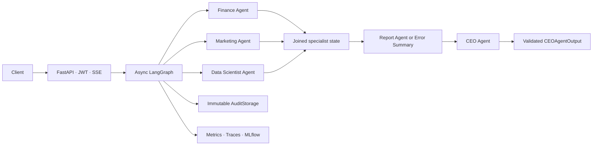
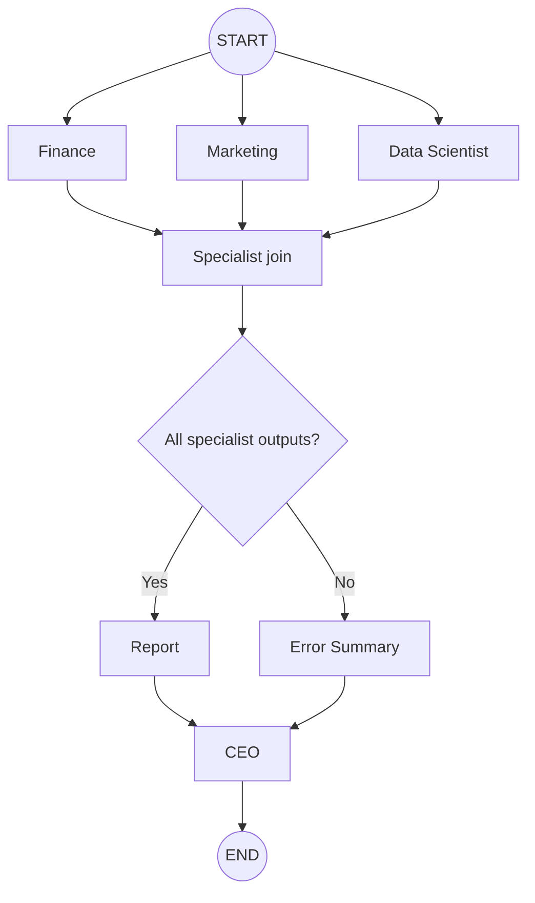

# Autonomous AI Company

[](CHANGELOG.md)
[](pyproject.toml)
[](#testing-and-quality)
[](LICENSE)
[](.github/workflows/ci.yml)

Autonomous AI Company is a production-oriented, asynchronous multi-agent
business-analysis platform. Deterministic Python tools calculate finance,
marketing, and analytics facts; specialist agents interpret those facts; a
Report Agent aggregates them; and a CEO Agent returns a validated strategic
decision through FastAPI or Server-Sent Events.

The project demonstrates Clean Architecture, dependency inversion, safe LLM
boundaries, parallel LangGraph execution, immutable audit history, optional
observability, and infrastructure-as-code without putting calculations or
provider details inside agents.

> **Release status:** v1.0.0. Python 3.12 is the only supported runtime.
> The included `admin` identity is for local demonstration and must be replaced
> before an internet-facing deployment.

## Highlights

- Five strict Pydantic agents: Finance, Marketing, Data Scientist, Report, CEO.
- `Decimal`-safe deterministic financial and marketing calculations.
- Parallel specialists, deterministic join, conditional degradation path, and
  optional injected checkpointing with LangGraph.
- Provider-neutral asynchronous `LLMProvider` and immutable
  `GenerationResult` with Anthropic, OpenAI, xAI Grok, Ollama, and injected
  test-fake adapters selected only at composition time.
- Bounded prompts, one validation-correction retry, provider-neutral errors,
  cancellation, and concurrency-safe dependency reuse.
- Deeply immutable, allowlisted audit events with in-memory or PostgreSQL
  storage.
- JWT-protected REST and SSE workflows plus public health/version endpoints.
- Optional MLflow, OpenTelemetry, and Prometheus adapters; provisioned Grafana
  dashboards.
- Docker, Kubernetes, Helm, Terraform/AWS, CI/CD, security, load, chaos,
  disaster-recovery, and SRE assets.

## Architecture



Editable diagrams:

- [System overview](assets/architecture/system-overview.drawio)
- [Workflow topology](assets/architecture/workflow.drawio)
- [Production deployment](assets/architecture/deployment.drawio)

See [Architecture](docs/architecture.md) for layer boundaries, dependency
direction, agent design, shared state, security, and runtime composition.

## Workflow



Every node receives `CompanyState`, calls an injected async agent, and returns
only its owned partial update. Specialist nodes can run concurrently. Report
waits for the join; missing results take the deterministic Error Summary path;
CEO receives available sections without fabricated data.

## Quick start

### 1. Install

```bash
python -m venv .venv
python -m pip install --upgrade pip
python -m pip install -e ".[test]"
```

Activate the environment, copy `.env.example` to `.env`, and set real local
values for `LLM_PROVIDER` and that provider's key/model variables. Anthropic
uses `ANTHROPIC_API_KEY` and `MODEL_ANTHROPIC`; see the
[environment guide](docs/environment.md) for every provider. Generate a JWT
signing key of at least 32 characters:

```bash
python -c "import secrets; print(secrets.token_urlsafe(48))"
```

Store that value as `JWT_SECRET_KEY` in the local `.env`. Never commit `.env`.

### 2. Start the API

```bash
uvicorn autonomous_ai_company.api.app:create_app --factory --reload
```

Check:

```bash
curl http://localhost:8000/health
curl http://localhost:8000/version
```

Open `http://localhost:8000/docs` for interactive OpenAPI documentation.

### 3. Authenticate and run

The local-only demo account is `admin` / `admin123`.

```bash
TOKEN=$(curl --fail --silent \
  -H 'Content-Type: application/json' \
  --data '{"username":"admin","password":"admin123"}' \
  http://localhost:8000/auth/login \
  | python -c "import json,sys; print(json.load(sys.stdin)['access_token'])")

curl --fail \
  -H "Authorization: Bearer $TOKEN" \
  -H 'Content-Type: application/json' \
  --data @workflow-request.json \
  http://localhost:8000/workflow/run
```

A complete request document and SSE example are in [API reference](docs/api.md).
Real workflow calls use the configured provider and may incur provider charges.

## LLM providers

Switch providers entirely through `.env`; agents and graph code do not change.

| `LLM_PROVIDER` | Credential            | Model               | Transport                 |
| ---------------- | --------------------- | ------------------- | ------------------------- |
| `anthropic`    | `ANTHROPIC_API_KEY` | `MODEL_ANTHROPIC` | Anthropic async SDK       |
| `openai`       | `OPENAI_API_KEY`    | `MODEL_OPENAI`    | OpenAI async SDK          |
| `grok`         | `XAI_API_KEY`       | `MODEL_GROK`      | OpenAI SDK pointed at xAI |
| `ollama`       | None                  | `MODEL_OLLAMA`    | Local async HTTP          |
| `fake`         | Injected by tests     | Test-controlled     | No network                |

Example OpenAI selection:

```dotenv
LLM_PROVIDER=openai
OPENAI_API_KEY=replace-with-your-key
MODEL_OPENAI=replace-with-a-model-available-to-your-account
```

See [Environment and provider configuration](docs/environment.md), including
local Ollama setup and safe switching instructions.

## API

| Method   | Path                 | Authentication            | Purpose                               |
| -------- | -------------------- | ------------------------- | ------------------------------------- |
| `GET`  | `/health`          | Public                    | Process liveness                      |
| `GET`  | `/version`         | Public                    | Application/version identity          |
| `POST` | `/auth/login`      | Public                    | Local demo JWT issuance               |
| `POST` | `/workflow/run`    | Bearer                    | Validated CEO result                  |
| `POST` | `/workflow/stream` | Bearer                    | Real workflow lifecycle over SSE      |
| `GET`  | `/metrics`         | Public/network-controlled | Present only when metrics are enabled |

The API returns `400` for deterministic domain input errors, `401` for invalid
credentials, `422` for request validation, `503` for provider-neutral LLM
failures, and a detail-safe `500` for unexpected failures.

## Containers and production deployment

### Docker

```bash
docker compose build --pull
docker compose up -d
```

The multi-stage image runs as a non-root user. Compose provides the API and
PostgreSQL with health checks and persistent audit storage. Development mode:

```bash
docker compose -f docker-compose.yml -f docker-compose.dev.yml up --build
```

See [Docker guide](README-docker.md).

### Kubernetes

Static manifests under [k8s](k8s/) define two replicas, rolling updates,
startup/readiness/liveness probes, restrictive security context, resource
requests/limits, network policy, PVC, ingress, and HPA scaling from 2 to 10.

### Helm

```bash
helm upgrade --install autonomous-ai-company \
  helm/autonomous-ai-company \
  --namespace autonomous-ai-company \
  --create-namespace \
  --values helm/autonomous-ai-company/values-prod.yaml
```

Environment values customize image, namespace, ingress, resources, storage,
configuration, secret names, and HPA without redesigning Kubernetes contracts.

### Terraform and AWS

The [Terraform reference stack](cloud/terraform/) defines VPC networking, EKS,
ECR, encrypted private RDS PostgreSQL, IAM separation, secret placeholders, and
monitoring endpoints. It is static infrastructure and is never applied by
tests. Read [AWS deployment](cloud/aws/README-aws.md) and
[production deployment](docs/deployment.md) before any plan or apply.

## Observability

- **Prometheus:** optional application-owned registry and `/metrics` endpoint.
- **Grafana:** five provisioned dashboards for overview, workflows, agents,
  LLMs, and audit behavior.
- **OpenTelemetry:** optional request/workflow/agent hierarchy with console or
  OTLP/HTTP export.
- **MLflow:** optional nested workflow and agent experiment runs.

Raw prompts, generated text, passwords, JWTs, API keys, and user identifiers
are excluded from default telemetry. See [Monitoring](README-monitoring.md) and
[Operations guide](docs/operations-guide.md).

## Security

- Centralized environment configuration; no hardcoded provider or JWT secret.
- Strict request/output schemas and bounded untrusted prompt content.
- Provider-neutral exception translation with preserved causes.
- Deeply immutable, event-allowlisted audit records.
- Non-root/read-only container and Kubernetes security controls.
- GitHub Actions assets for dependency, Bandit, Semgrep, Trivy, OSV, SBOM, and
  keyless Cosign verification.
- GitHub OIDC deployment flow without static AWS access keys.

Read [Security policy](security/SECURITY.md) and report vulnerabilities through
[Security Contact](SECURITY_CONTACT.md), never a public issue.

## Performance and benchmarks

The repository includes repeatable k6 and Locust profiles:

| Profile | Virtual users | Intent                                                   |
| ------- | ------------: | -------------------------------------------------------- |
| Smoke   |             5 | Validate scripts, credentials, endpoints, and thresholds |
| Normal  |            50 | Expected sustained operating behavior                    |
| Peak    |           200 | Anticipated high-traffic window                          |
| Stress  |           500 | Discover saturation and recovery boundaries              |
| Spike   | 0 → 500 → 0 | Sudden admission pressure and recovery                   |

Acceptance thresholds target health P95 below 100 ms, login P95 below 300 ms,
workflow P95 below 3 seconds, and error/failed-check rates below 1%.

These are test definitions—not measured production benchmarks. Throughput and
latency depend on provider quota, model, network, data, and deployment. See the
[performance guide](performance/reports/README-performance.md) for honest
measurement and HPA tuning.

## Reliability, disaster recovery, and SRE

- Opt-in [chaos definitions](docs/chaos-engineering.md) cover pod, CPU, memory,
  network, and PostgreSQL faults without automatic production execution.
- [Disaster recovery](docs/disaster-recovery.md) defines RTO/RPO, backup,
  retention, encryption adapters, suspended restore jobs, and restore testing.
- [SLOs and SLIs](operations/slo/) define targets and explicit measurement gaps.
- [Alertmanager routing](operations/alertmanager/) defines credential-free
  default/warning/critical policy and inhibition.
- [Runbooks](operations/runbooks/) and [on-call templates](operations/oncall/)
  cover diagnosis, recovery, escalation, rollback, verification, and learning.

## Project structure

```text
.
├── src/autonomous_ai_company/  application package
├── tests/                      unit, integration, monitoring, infrastructure
├── docs/                       release and operational guides
├── assets/                     editable diagrams, screenshot notes, demo
├── monitoring/                 Prometheus and Grafana assets
├── operations/                 Alertmanager, SLOs, runbooks, on-call
├── performance/                k6 and Locust profiles
├── chaos/                      opt-in Litmus experiment definitions
├── dr/                         backup, restore, and recovery runbooks
├── k8s/                        Kubernetes manifests
├── helm/                       reusable Helm chart
├── cloud/                      AWS guidance and Terraform
├── security/                   scanning policies and disclosure details
├── scripts/                    deployment, rollback, smoke testing
└── .github/workflows/          CI, CD, security, and manual validation
```

## Testing and quality

```bash
python -m pip install -e ".[test]" \
  "ruff==0.15.20" "pytest-cov>=7,<8" "build>=1.3,<2"
ruff check .
ruff format --check .
pytest --cov=autonomous_ai_company --cov-branch \
  --cov-report=term-missing --cov-report=xml:coverage.xml \
  --cov-fail-under=100
python -m build --wheel --sdist
```

The v1.0 release suite has 100% application statement and branch coverage.
Tests use fake providers and isolated observability registries; no real LLM
network call is required. PostgreSQL integration uses testcontainers or an
explicit isolated DSN and skips honestly when neither is available.

## Demo

The [demo script](assets/demo/demo-script.md) walks through architecture,
startup, authentication, synchronous execution, SSE progress, audit safety,
observability, and shutdown using synthetic data.

## Screenshots

No fabricated product screenshots are committed. The
[screenshot capture guide](assets/screenshots/README.md) defines the required
views, redaction rules, filenames, and acceptance checks for captures from a
real local demo environment.

## FAQ

### Does the LLM calculate business metrics?

No. Deterministic tools calculate metrics. Prompts explicitly prohibit number
calculation and agents validate only reasoning outputs.

### Can I use another provider?

The `LLMProvider` contract supports Anthropic, OpenAI, xAI Grok, Ollama, and
explicitly injected test fakes. Add another adapter and one factory registration
without changing agents.

### Is authentication production-ready?

JWT verification is strict, but the single in-memory demo identity is not a
production identity store. The roadmap replaces it with OpenID Connect.

### Is workflow execution durable?

Checkpoint injection exists, but the default saver and request execution are
not a durable distributed job system. Durable checkpoint storage and background
execution are future work.

### Are performance figures guaranteed?

No. Profiles and thresholds define what to measure. Only retained results from
the target environment establish capacity.

### Where do I start when something fails?

Use [Troubleshooting](docs/troubleshooting.md), then select the relevant
[operational runbook](operations/runbooks/) and escalation policy.

## Contributing and governance

Read [Contributing](CONTRIBUTING.md), [Code of Conduct](CODE_OF_CONDUCT.md),
[Changelog](CHANGELOG.md), and [Roadmap](ROADMAP.md). Architecture changes must
preserve deterministic calculation boundaries and dependency direction.

## License

Released under the [MIT License](LICENSE).

## Acknowledgements

Built with Python, Pydantic, FastAPI, LangGraph, Anthropic's Python SDK,
PostgreSQL, MLflow, OpenTelemetry, Prometheus, Grafana, Docker, Kubernetes,
Helm, Terraform, pytest, and Ruff. Their maintainers and communities make this
reference architecture possible.
