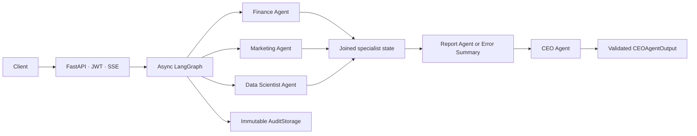

# Autonomous AI Company

[](CHANGELOG.md)
[](pyproject.toml)
[](#testing-and-quality)
[](LICENSE)

> **Personal portfolio project, independently built and AI-assisted.**
> Designed and directed solo, using Claude and Codex as development
> partners for implementation. Not affiliated with, produced for, or
> commissioned by any employer. See [About this project](#about-this-project)
> for exactly what that means and how the work was done.

**Autonomous AI Company** is a multi-agent business-analysis platform.
Deterministic Python tools calculate finance, marketing, and analytics
facts; specialist LLM agents interpret those facts; a Report Agent
aggregates them; and a CEO Agent returns a validated strategic summary —
all served through FastAPI with real-time streaming.

The project explores clean architecture, dependency inversion, safe LLM
boundaries, parallel LangGraph execution, and immutable audit logging,
with one hard rule enforced throughout:

> **LLMs never calculate numbers — only Python does.**

---

## Table of contents

- [About this project](#about-this-project)
- [Highlights](#highlights)
- [Architecture](#architecture)
- [Quick start](#quick-start)
- [LLM providers](#llm-providers)
- [API](#api)
- [Testing and quality](#testing-and-quality--verified-real-numbers)
- [Project structure](#project-structure)
- [FAQ](#faq)
- [License](#license)
- [Acknowledgements](#acknowledgements)

---

## About this project

This project is real, runs locally, and its test suite genuinely passes —
every claim below can be verified by cloning the repo and running the
commands in [Quick start](#quick-start). It was **not** built by hand,
line by line. It was built through directed, reviewed, AI-assisted
development:

- **I designed** the agent architecture, the tool/reasoning separation
  principle, the schema-validation approach, and the overall project scope.
- **Claude and Codex implemented** most of the code, guided phase by phase
  through detailed specifications I wrote and reviewed.
- **I reviewed and ran** the resulting tests and verified the coverage
  numbers below are real, not aspirational.

I'm stating this openly because directing AI coding agents effectively —
architecture-first, spec-driven, test-verified — is itself a real skill,
and one directly relevant to agentic AI development work. I'd rather be
evaluated on that honestly than have it discovered later.

**Depth varies by module.** I can walk through the agent design, the
LangGraph orchestration, the LLM abstraction layer, and the testing
strategy in real depth — that's where my direct involvement was deepest.
The infrastructure-as-code assets (Kubernetes, Terraform, Helm, chaos
engineering) are included as reference implementations generated with AI
assistance; I understand them at a conceptual level but have not operated
them in a live production environment.

## Highlights

- **Five strict Pydantic agents** — Finance, Marketing, Data Scientist,
  Report, and CEO — each with schema-validated inputs and outputs.
- **`Decimal`-safe deterministic calculations** for finance and marketing
  metrics; the LLM never performs arithmetic.
- **Parallel specialist execution** with a deterministic join and a
  conditional degradation path via LangGraph.
- **Provider-neutral async `LLMProvider` interface** — Anthropic, OpenAI,
  xAI Grok, Ollama, and a test-fake adapter, all swappable via `.env`
  alone.
- **Bounded prompts** with a single validation-correction retry and
  provider-neutral error handling.
- **Immutable, allowlisted audit events**, backed by in-memory or
  PostgreSQL storage.
- **JWT-protected REST and Server-Sent Events (SSE)** workflow endpoints.
- **Optional observability adapters** (MLflow, OpenTelemetry, Prometheus)
  and infrastructure-as-code references (Docker, Kubernetes, Helm,
  Terraform) — included to demonstrate the pattern, not verified in
  production.

## Architecture



Every graph node receives `CompanyState`, calls an injected async agent,
and returns only its own partial update. Specialist nodes run
concurrently; the Report node waits for the join and takes a
deterministic error-summary path if any specialist result is missing,
rather than fabricating data.

## Quick start

```bash
python -m venv .venv
source .venv/bin/activate   # or .venv\Scripts\activate on Windows
python -m pip install --upgrade pip
python -m pip install -e ".[test]"
```

Copy `.env.example` to `.env` and set `LLM_PROVIDER` plus that provider's
credential/model variables (e.g. `ANTHROPIC_API_KEY`, `MODEL_ANTHROPIC`).

Generate a JWT signing key:

```bash
python -c "import secrets; print(secrets.token_urlsafe(48))"
```

Run the API:

```bash
uvicorn autonomous_ai_company.api.app:create_app --factory --reload
curl http://localhost:8000/health
```

Interactive API docs are available at `http://localhost:8000/docs`.

## LLM providers

Providers are switched through `.env` only — agent and graph code never
changes.

| `LLM_PROVIDER` | Credential          | Model             |
| --------------- | -------------------- | ------------------ |
| `anthropic`     | `ANTHROPIC_API_KEY`  | `MODEL_ANTHROPIC`  |
| `openai`        | `OPENAI_API_KEY`     | `MODEL_OPENAI`     |
| `grok`          | `XAI_API_KEY`        | `MODEL_GROK`       |
| `ollama`        | *(none)*             | `MODEL_OLLAMA`     |
| `fake`          | Injected by tests    | Test-controlled    |

## API

| Method | Path                | Auth   | Purpose                           |
| ------ | -------------------- | ------ | ---------------------------------- |
| GET    | `/health`            | Public | Liveness check                     |
| GET    | `/version`           | Public | Version identity                   |
| POST   | `/auth/login`        | Public | Local demo JWT issuance            |
| POST   | `/workflow/run`      | Bearer | Synchronous validated CEO result   |
| POST   | `/workflow/stream`   | Bearer | Workflow lifecycle over SSE        |

## Testing and quality — verified, real numbers

```bash
pytest --cov=autonomous_ai_company --cov-branch --cov-report=term-missing
```

```
696 passed, 1 skipped
TOTAL   3079 statements   0 missed   616 branches   0 partial   100% coverage
```

This is the actual output from running the suite locally — not a claim
copied from a template. Tests use fake LLM providers and isolated
observability registries; no real API network call is required to run
the suite. Re-run it yourself to verify.

## Project structure

```text
.
├── src/autonomous_ai_company/  # application package
├── tests/                      # unit, integration, monitoring, infrastructure
├── docs/                       # architecture and environment guides
├── k8s/ helm/ cloud/           # infrastructure-as-code references (not deployed)
├── monitoring/ operations/     # observability and runbook references
└── .github/workflows/          # CI configuration
```

## FAQ

**Does the LLM calculate business metrics?**
No. Deterministic Python tools calculate every metric. Prompts explicitly
prohibit the model from computing numbers, and agent outputs are schema
validated to catch violations.

**Was this built manually, line by line?**
No — see [About this project](#about-this-project). It was directed,
spec-driven, AI-assisted development, with architecture decisions and
verification done by the author.

**Is the infrastructure-as-code (Kubernetes/Terraform/chaos engineering)
production-tested?**
No. These are included as reference implementations to demonstrate the
patterns, generated with AI assistance. They are not deployed or
operated in any live environment.

**Can I use another LLM provider?**
Yes. The `LLMProvider` interface supports Anthropic, OpenAI, xAI Grok,
Ollama, and test fakes. Adding another provider requires one adapter plus
a factory registration, with no changes to agent code.

## License

Released under the [MIT License](LICENSE).

## Acknowledgements

Built with Python, Pydantic, FastAPI, LangGraph, and the Anthropic and
OpenAI Python SDKs — developed with Claude and Codex as AI coding
partners, directed and reviewed by the author.
