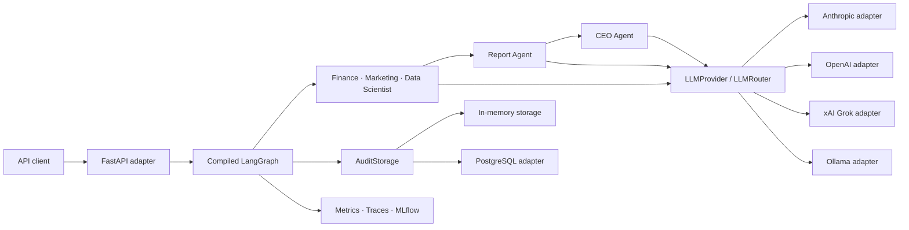
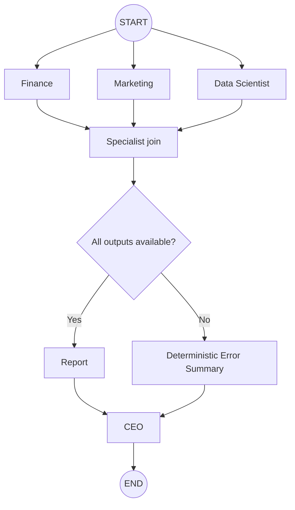
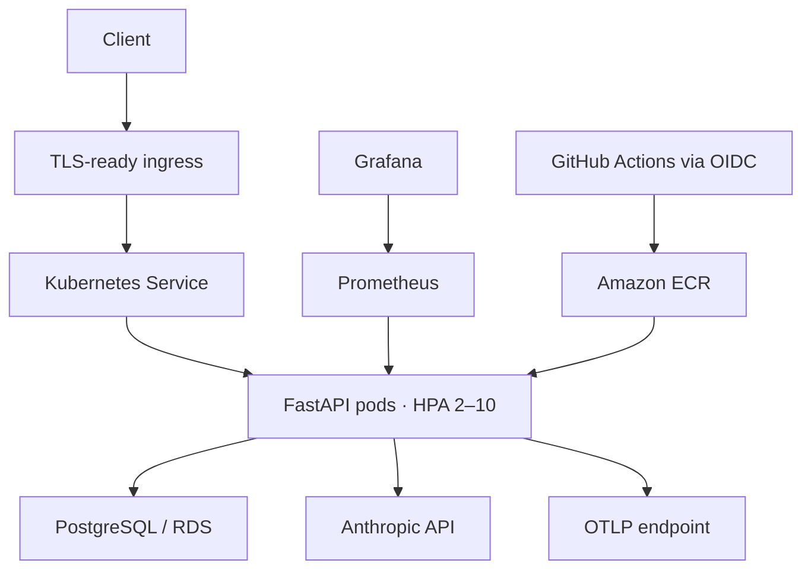

# Architecture

Autonomous AI Company applies Clean Architecture to an asynchronous multi-agent
business-analysis workflow. Deterministic tools own calculations; language
models interpret supplied facts; LangGraph owns execution topology; FastAPI and
infrastructure adapters remain at the outside boundary.

## System context

Editable source: [system-overview.drawio](../assets/architecture/system-overview.drawio).

## Dependency direction

The inner layers define data contracts and behavior. Outer adapters depend on
those contracts, not the reverse:

1. **Schemas and exceptions** define validated, provider-neutral boundaries.
2. **Tools** implement deterministic calculations without network or file I/O.
3. **Prompts and agents** separate trusted metrics from bounded user content;
   agents coordinate tools, providers, validation, audit, and telemetry.
4. **Graph** adapts agents to shared `CompanyState` and owns topology/routing.
5. **API** validates HTTP input, invokes an injected compiled graph, and maps
   application errors to transport responses.
6. **Infrastructure adapters** implement Anthropic, OpenAI-compatible APIs,
   Ollama, PostgreSQL, MLflow, OpenTelemetry, Prometheus, containers, and cloud
   deployment.
7. **Bootstrap** is the composition root and constructs concrete dependencies.

Provider SDK response objects, database connections, and HTTP concerns do not
cross inward into tools, schemas, or graph state.

## Agent architecture

Finance, Marketing, and Data Scientist agents follow the same orchestration
template:

1. receive validated input;
2. invoke deterministic tools;
3. build a bounded prompt containing trusted calculated data and clearly marked
   untrusted context;
4. call the asynchronous `LLMProvider`;
5. validate `GenerationResult.text` into a strict Pydantic output;
6. issue one bounded correction request when validation fails;
7. audit and observe lifecycle events without raw prompts or generated text;
8. return the validated model or a domain-specific exception.

Report aggregates validated specialist conclusions without recalculation. CEO
performs strategic synthesis and conflict resolution without changing supplied
conclusions. All five agents use constructor injection and remain unaware of
the selected LLM provider, PostgreSQL, FastAPI, and LangGraph.

## LangGraph workflow

Editable source: [workflow.drawio](../assets/architecture/workflow.drawio).

Specialists run as parallel branches. LangGraph merges their owned partial
updates at a join. The routing function sends complete state to Report or sends
partial state through deterministic Error Summary. CEO accepts available
specialist sections and never fabricates absent outputs. Optional checkpointing
is injected when the graph is compiled; topology does not know persistence.

## Shared state

`CompanyState` is a `TypedDict` containing the dataset, each agent result,
audit and generation records, execution status, errors, and metadata. Nodes
receive the same state but return only fields they own. No node mutates shared
state or constructs dependencies. This makes parallel merges explicit and
keeps node tests isolated.

## Security and integrity boundaries

- Settings come from environment variables and secrets use `SecretStr`.
- Prompt construction bounds business context, questions, analytics payloads,
  and invalid correction responses.
- Audit events are deeply immutable and use per-event allowlists.
- Raw prompts, generated text, JWTs, API keys, passwords, and user identifiers
  are excluded from default telemetry.
- JWT authentication terminates in FastAPI dependencies; the graph and agents
  do not know user identities.
- Domain exceptions preserve original causes while provider adapters translate
  SDK-specific errors.

## Runtime composition

`bootstrap.py` creates one runtime dependency set: settings, storage, audit
logger, provider/router, tracking client, tracer, metrics collector, and the
five agents. `provider_factory.py` supplies lazy concrete constructors and
`LLMRouter` resolves exactly the configured one. Bootstrap then injects nodes
into the graph builder. Optional adapters select null or in-memory
implementations when disabled.

## Deployment architecture

Editable source: [deployment.drawio](../assets/architecture/deployment.drawio).
The Terraform and Kubernetes assets are production templates and are not
automatically applied by documentation or static tests.
